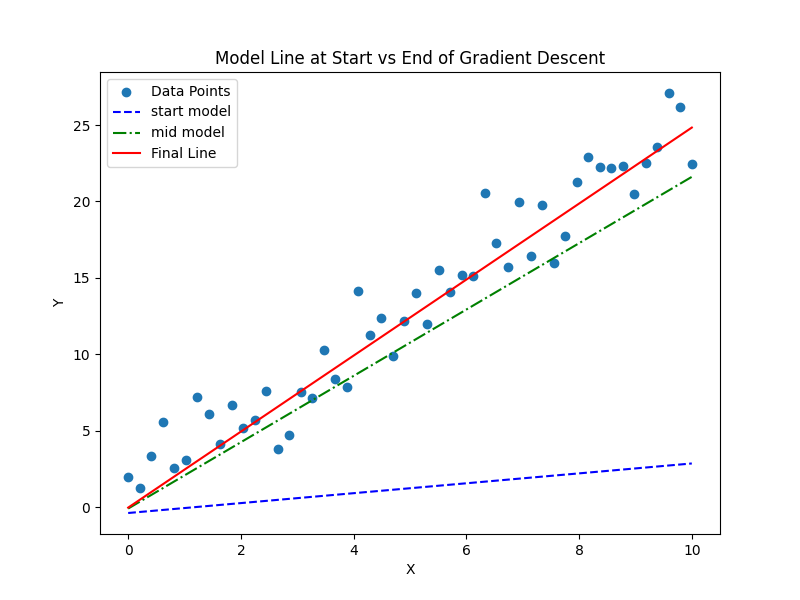
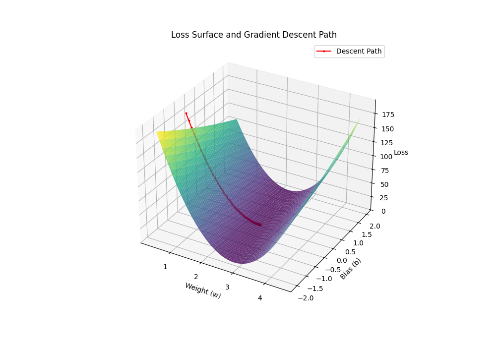
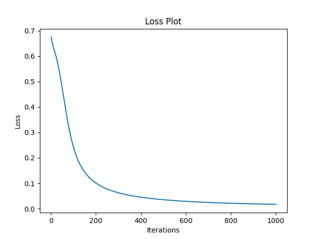
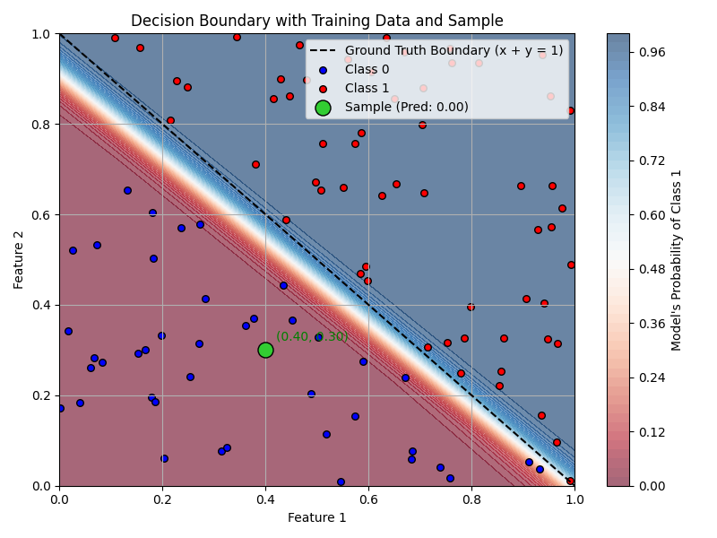

# sgune-ai
My experiments in AI

## [Regression using Gradient Descent](./regression-gradient/)



## [Neural Networks](./neural-net/)



## [MCP Server](./mcp-server/)


## [fastAPI](./fastapi/)
```
uvicorn fastAPI:app --reload
INFO:     Will watch for changes in these directories: ['C:\\Users\\sgune\\sgune-dev\\sgune-ai\\fastapi']
INFO:     Uvicorn running on http://127.0.0.1:8000 (Press CTRL+C to quit)
INFO:     Started reloader process [5020] using StatReload
Model: RandomForestClassifier(n_estimators=50, random_state=42), Genres: ['rock', 'pop', 'jazz']
INFO:     Started server process [22692]
INFO:     Waiting for application startup.
INFO:     Application startup complete.
INFO:     127.0.0.1:41492 - "GET / HTTP/1.1" 200 OK
INFO:     127.0.0.1:41511 - "GET /docs HTTP/1.1" 200 OK
INFO:     127.0.0.1:41511 - "GET /openapi.json HTTP/1.1" 200 OK
INFO:     127.0.0.1:41523 - "POST /predict HTTP/1.1" 200 OK

```

Testing
```

curl -X 'POST' \
  'http://127.0.0.1:8000/predict' \
  -H 'accept: application/json' \
  -H 'Content-Type: application/json' \
  -d '{
  "tempo": 10,
  "energy": 1111,
  "danceability": 111111
}'

OUTPUT:
{
  "prediction": "pop",
  "probabilities": {
    "rock": 0.32,
    "pop": 0.46,
    "jazz": 0.22
  }
}

RESPONSE HEADERS:
 content-length: 73  content-type: application/json  date: Wed,01 Oct 2025 05:41:57 GMT  server: uvicorn 

```


## [Retrieval Augmented Genration (RAG)](./rag-project/)
  ### System Architecture

  ```mermaid
  graph TB
      subgraph Input
          A[Documents in ./docs] --> B[Document Loader]
          Q[User Query] --> W[Web UI/CLI]
      end

      subgraph Processing
          B --> C[Chunker]
          C --> D[Vector DB]
          D --> E[FAISS Index]
      end

      subgraph Query
          W --> F[Query Processor]
          F --> E
          E --> G[Retriever]
          G --> H[Context Builder]
      end

      subgraph Generation
          H --> I[Ollama LLM]
          I --> J[Response]
      end

      style Input fill:#f9f,stroke:#333,stroke-width:2px
      style Processing fill:#bbf,stroke:#333,stroke-width:2px
      style Query fill:#bfb,stroke:#333,stroke-width:2px
      style Generation fill:#fbb,stroke:#333,stroke-width:2px
  ```
  - RAG Test
  ```
  Loaded existing vector database
  Ask a question (or 'quit' to exit): who is shreyas?

  Generating answer...

  Answer:  In the provided context, Shreyas is a band member and co-founder of Eximius Dominus. He joined Eximius Dominus in 2009 along with Sid Sharma, and his role includes playing drums and contributing to lyrics for their music.

  Sources:

  - Source: test.txt
    Relevance score: 0.7850
    Preview: Shreyas joined them in the year 2022 as their peak songwriter....

  - Source: shrey.txt
    Relevance score: 1.2640
    Preview: Eximius Dominus (in Latin 'Eximius' means Extraordinary and 'Dominus' means Ruler / Dominator) is a Heroic Folk Metal band from Thane, Maharashtra, formed in 2009 by Shreyas Gune and Sid Sharma. They ...

  - Source: shrey.txt
    Relevance score: 1.4819
    Preview: Band Members :
  Tejas Dani - Vocals
  Rishi Nandy - Guitars
  Sid - Guitars
  Kunal Dey - Bass / Vocals
  Shreyas M Gune - Drums / Lyrics
  Rajat Srivastava - Synth & Samples

  Demo 'Rise of The Warlords' 2010...
  Ask a question (or 'quit' to exit):

```

---

## References


[Daniel Voight's book](https://cbwilp-artefacts.s3.ap-south-1.amazonaws.com/AIML/SEM2/FREE_BOOKS/Daniel+Voigt+Godoy+-+Deep+Learning+with+PyTorch+Step-by-Step+A+Beginner%E2%80%99s+Guide-leanpub.com+(2022).pdf)

[Deep Learning by Howard Gugger](https://dl.ebooksworld.ir/books/Deep.Learning.for.Coders.with.fastai.and.PyTorch.Howard.Gugger.OReilly.9781492045526.EBooksWorld.ir.pdf)
