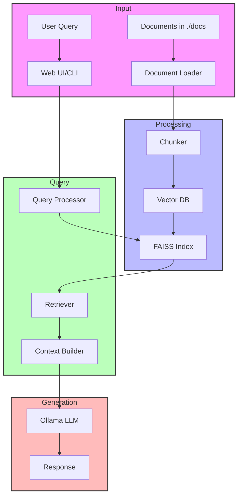

# sgune-ai
My experiments in AI

## [Regression using Gradient Descent](./regression-gradient/)


## [Neural Networks](./neural-net/)


## [Retrieval Augmented Genration (RAG)](./rag-project/)
## System Architecture

### Data Flow Diagram

- RAG Test
```
Loaded existing vector database
Ask a question (or 'quit' to exit): who is shreyas?

Generating answer...

Answer:  In the provided context, Shreyas is a band member and co-founder of Eximius Dominus. He joined Eximius Dominus in 2009 along with Sid Sharma, and his role includes playing drums and contributing to lyrics for their music.

Sources:

- Source: test.txt
  Relevance score: 0.7850
  Preview: Shreyas joined them in the year 2022 as their peak songwriter....

- Source: shrey.txt
  Relevance score: 1.2640
  Preview: Eximius Dominus (in Latin 'Eximius' means Extraordinary and 'Dominus' means Ruler / Dominator) is a Heroic Folk Metal band from Thane, Maharashtra, formed in 2009 by Shreyas Gune and Sid Sharma. They ...

- Source: shrey.txt
  Relevance score: 1.4819
  Preview: Band Members :
Tejas Dani - Vocals
Rishi Nandy - Guitars
Sid - Guitars
Kunal Dey - Bass / Vocals
Shreyas M Gune - Drums / Lyrics
Rajat Srivastava - Synth & Samples

Demo 'Rise of The Warlords' 2010...
Ask a question (or 'quit' to exit):

```

---

## References


[Daniel Voight's book](https://cbwilp-artefacts.s3.ap-south-1.amazonaws.com/AIML/SEM2/FREE_BOOKS/Daniel+Voigt+Godoy+-+Deep+Learning+with+PyTorch+Step-by-Step+A+Beginner%E2%80%99s+Guide-leanpub.com+(2022).pdf)

[Deep Learning by Howard Gugger](https://dl.ebooksworld.ir/books/Deep.Learning.for.Coders.with.fastai.and.PyTorch.Howard.Gugger.OReilly.9781492045526.EBooksWorld.ir.pdf)
