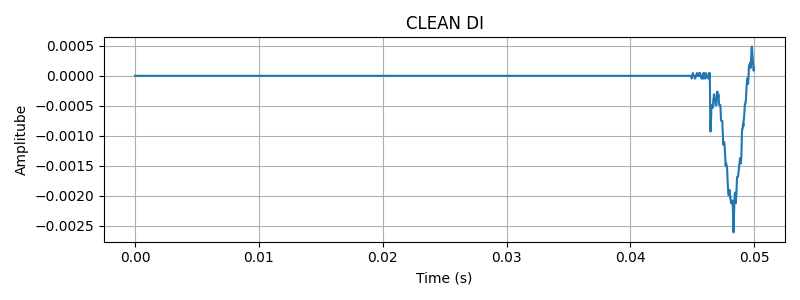
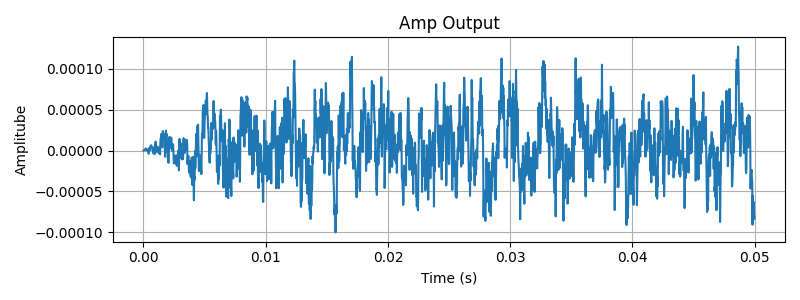
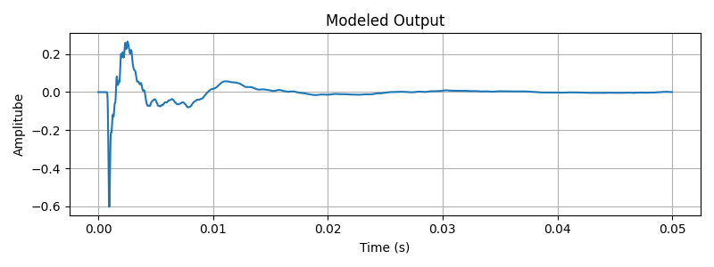
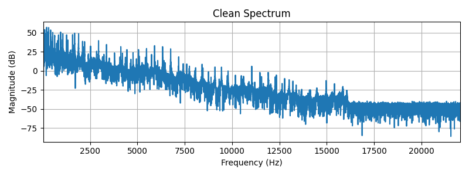
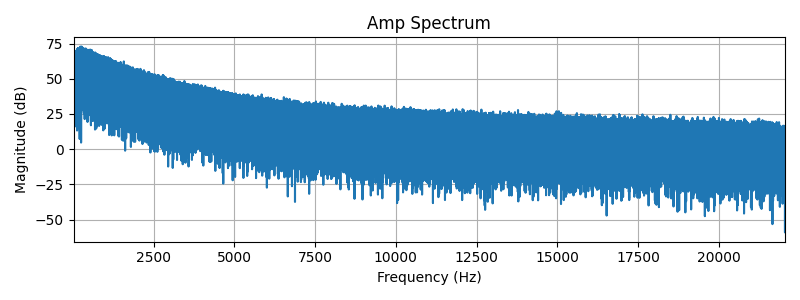
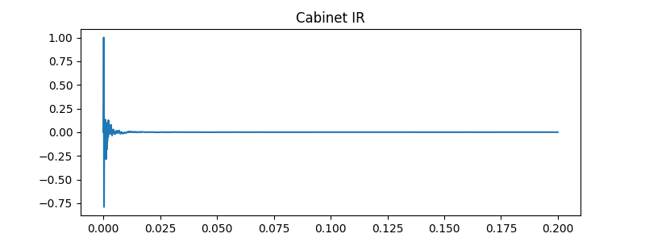
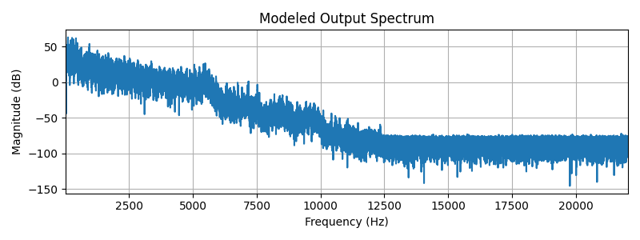
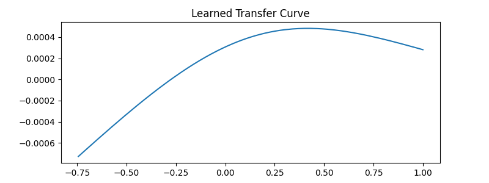

# Guitar Amplifier & Cabinet Neural Network Model

A deep learning project that uses a convolutional neural network to model the non-linear behavior of guitar amplifiers and simulate speaker cabinet impulse responses. The trained model can process clean guitar audio and produce a realistic amplified output with cabinet coloration.

Listen to the stuff here: https://soundcloud.com/lewmos/sets/guneamp-neural-network-test-set 
---

## Overview

This project aims to **digitally model analog guitar amplifier circuitry and speaker cabinet acoustics** using a neural network approach. Instead of trying to simulate the physical physics of vacuum tubes and speakers, we train a CNN to learn the non-linear transfer function by example, enabling real-time or near-real-time guitar amp simulation.

### Key Goals:
- Train a lightweight CNN that learns amp + cab characteristics from reference audio
- Achieve realistic, perceptually convincing amplifier tone from a clean DI (direct injection) signal
- Demonstrate GPU-accelerated training for fast iteration
- Visualize the learned transfer function and spectral characteristics

---
## Graphs and How to read this stuff

### Clean DI Waveform


This plot shows the raw guitar signal recorded directly from the instrument, without amplification or effects.
The waveform has a relatively simple shape and lower overall energy, which reflects the lack of distortion and compression.
When reading similar plots, cleaner signals typically appear more sparse and less “dense” over time.

What this implies: This is the baseline signal the model must transform.

### Amp Output Waveform


This waveform shows the real amplifier’s output in the time domain.
The signal appears denser and more compressed, indicating nonlinear distortion and dynamic leveling caused by the amp circuitry.
In general, increased waveform density and irregular shapes suggest saturation and harmonic generation.

What this implies: The target sound contains strong nonlinear behavior.

### Modeled Output Waveform


This waveform represents the neural network’s processed output.
Its visual similarity to the real amp waveform indicates that the model has learned to reproduce distortion and compression.
When evaluating your own models, mismatched waveform density can indicate underfitting or incorrect normalization.

What this implies: The model is producing realistic time-domain behavior.

### Clean Spectrum


This spectrum shows how the clean DI signal’s energy is distributed across frequencies.
Notice the broader frequency range and stronger high-frequency content, which is typical of direct guitar recordings.
When reading spectra, taller peaks indicate stronger frequencies, and wide bandwidth indicates less filtering.

What this implies: The input signal contains more raw information than a finished guitar tone.

### Amp Spectrum


This plot shows the frequency content of the real amplified signal.
Energy is concentrated in the low and mid frequencies, with reduced high frequencies due to distortion and speaker interaction.
In guitar tones, a mid-focused spectrum is a strong indicator of a realistic amp sound.

What this implies: The amp shapes the tone, not just the loudness.

### Cabinet IR


This plot represents the cabinet impulse response, showing how the cabinet reacts to a very short input signal.
A sharp initial spike followed by a fast decay is characteristic of real speaker cabinets.
When reading IRs, long ringing or oscillations usually indicate unrealistic or problematic responses.

What this implies: The cabinet behaves like a real physical system.

### Cabinet IR Spectrum


This spectrum shows how the cabinet filters different frequencies.
High frequencies are strongly attenuated, which explains why guitar cabinets sound warm and not harsh.
In general, steep high-frequency roll-off is expected for guitar speaker cabinets.

What this implies: The cabinet plays a critical role in shaping the final tone.

### Modeled Output Spectrum


This plot shows the frequency content of the model’s final output after amp modeling and cabinet filtering.
A close match to the real amp spectrum indicates that the model has learned both nonlinear distortion and frequency shaping.
When evaluating models, spectral mismatches often point to missing cabinet modeling or insufficient training data.

What this implies: The model produces perceptually realistic tonal balance.

### Learned Transfer Curve


This curve shows how the model maps input signal levels to output levels.
The curved, non-linear shape indicates saturation, which is essential for distortion.
In general, straight lines imply linear systems, while curves imply nonlinear behavior.

What this implies: The network has learned distortion rather than acting as a simple filter.

---

## What's Being Done

### 1. **Data Preparation Phase**

The pipeline starts by loading three audio files and preparing them for training:

#### Input Audio Files:
- **clean.wav**: A clean, dry guitar recording (direct input, no processing)
- **amp.wav**: The same guitar recording processed through a real amplifier and cabinet
- **cab_ir.wav**: An impulse response (IR) of the speaker cabinet

#### Loading and Normalization:
Audio is loaded using librosa to avoid backend compatibility issues:

```python
# From audio_utils.py
def load_wav(path):
    x, sr = librosa.load(path, sr=None, mono=True)
    x = torch.from_numpy(x).float()
    x = x / (x.abs().max() + 1e-8)  # Normalize to [-1, 1]
    return x, sr
```

Each audio signal is normalized to the range [-1, 1] to prevent numerical instability and ensure consistent training dynamics.

#### Oversampling Strategy:
Audio is upsampled 8x during training to capture fine details in the frequency domain:

```python
def oversample(x, factor):
    return F_audio.resample(x, 1, factor)
```

**Why 8x oversampling?**
- At 44.1 kHz, guitar transients can occur at rates requiring higher temporal resolution
- 8x upsampling (to ~352.8 kHz) preserves high-frequency nuances in distortion and string attack
- More training samples per second of audio improves convergence
- Improves numerical stability in the network's learned transfer function

#### Training Window Creation:
Audio windows of 256 samples are extracted as training examples using a sliding window approach:

```python
def make_window(x, y, window):
    X, Y = [], []
    for i in tqdm(range(window, len(x)), desc="Creating training windows"):
        X.append(x[i - window:i])  # 256 historical samples
        Y.append(y[i])             # Single target output sample
    return torch.stack(X), torch.tensor(Y)
```

For each position $i$, the network receives 256 historical samples $x[i-256:i]$ and must predict the corresponding output sample $y[i]$. This creates a causal, sliding-window training setup.

### 2. **Model Training**

A convolutional neural network with dilated convolutions learns to map clean audio → amplified audio.

#### Network Architecture:
```
Input: (batch_size, 1, 256)  [batch, channels, samples]
    ↓
Conv1d(1 → 32, kernel=3, padding=1, dilation=1)
    ↓
Tanh activation
    ↓
Conv1d(32 → 32, kernel=3, padding=2, dilation=2)
    ↓
Tanh activation
    ↓
Conv1d(32 → 32, kernel=3, padding=4, dilation=4)
    ↓
Tanh activation
    ↓
Conv1d(32 → 1, kernel=3, padding=1, dilation=1)  [linear output]
    ↓
Output: (batch_size, 1)  [single sample prediction]
```

**Parameter Count:** ~4,000 (very lightweight for fast inference)

#### Loss Function:
The training uses a two-part loss combining reconstruction and perceptual accuracy:

```python
loss = MSE(predicted, target) + 0.5 * MSE(pre_emphasis(predicted), pre_emphasis(target))
```

**MSE Term**: Ensures overall waveform reconstruction accuracy
**Pre-Emphasis Term**: Uses a high-pass filter to emphasize high-frequency transients:

```python
def pre_emphasis(x, coeff=0.95):
    return x[1:] - coeff * x[:-1]
```

This high-pass filtered loss encourages the model to match sharp attacks and harmonic content critical for guitar tone authenticity. The coefficient 0.95 creates a filter that boosts frequencies inversely proportional to their wavelength, emphasizing rapid changes.

**Weight Balance:** The 0.5 scaling on the pre-emphasis term prevents over-emphasis on high frequencies while still prioritizing transient fidelity.

### 3. **Inference**

Once trained, the model processes the clean audio in a causal, sliding-window fashion with batched GPU processing:

```python
def run_inference(
    model,
    clean_os,
    cab_ir,
    oversample_factor,
    window,
    device,
    sr,
    output_file="modeled.wav",
    batch_size=32
):
    model.eval()
    N = clean_os.shape[0]
    out_os = torch.zeros(N, device=device)
    weight = torch.zeros(N, device=device)

    with torch.no_grad():
        for i in tqdm(range(0, N - window, batch_size), desc="running inference"):
            # Extract and batch multiple inference windows
            batch_end = min(i + batch_size, N - window)
            batch_size_actual = batch_end - i
            
            windows = []
            for j in range(i, batch_end):
                x = clean_os[j:j+window].unsqueeze(0)  # [1, window]
                windows.append(x)
            
            x_batch = torch.cat(windows, dim=0).unsqueeze(1)  # [batch_size, 1, window]
            y_batch = model(x_batch)  # [batch_size, 1, 1]
            
            # Apply results with overlap-add for smooth reconstruction
            for j, idx in enumerate(range(i, batch_end)):
                y = y_batch[j].squeeze()
                out_os[idx:idx+window] += y
                weight[idx:idx+window] += 1.0

    # Normalize overlap-add
    out_os = out_os / weight.clamp(min=1.0)
```

**Key Points:**
- **Batching**: Multiple windows are processed in parallel for GPU efficiency (batch_size=32)
- **Overlap-Add**: Each output sample is the average of predictions from overlapping windows, providing smooth reconstruction
- **Causal Processing**: For sample $i$, only samples $[0...i-1]$ influence the output, enabling real-time processing

### 4. **Post-Processing**

The raw network output undergoes downsampling and impulse response convolution:

#### Downsampling:
```python
if oversample_factor > 1:
    out = downsample(out_os, oversample_factor)
    out_sr = sr
```

The 8x upsampled signal is downsampled back to the original sample rate.

#### Cabinet IR Application:
```python
def apply_ir(signal, ir):
    """
    signal: [N]
    ir:     [K]
    returns: [N + K - 1] (convolution output length)
    """
    signal = signal.unsqueeze(0).unsqueeze(0)  # [1,1,N]
    ir = ir.unsqueeze(0).unsqueeze(0)           # [1,1,K]
    
    padding = ir.shape[-1] - 1
    
    out = F.conv1d(
        signal,
        ir,
        padding=padding
    )
    
    return out.squeeze()
```

The cabinet IR is applied via 1D convolution, which linearly filters the network output to simulate the speaker cabinet's acoustic coloration.

#### Normalization:
```python
out = out / out.abs().max().clamp(min=1e-8)
```

Final output is normalized to prevent clipping while maintaining loudness consistency.

### 5. **Visualization**

The project generates detailed charts showing:

- Input waveforms and spectra (before processing)
- Learned transfer curve (amplitude in vs. out) showing the amp's non-linear characteristic
- Output waveforms and spectra (after neural network + IR)
- Cabinet IR frequency response characteristics
---


## License
MIT License - feel free to use and modify for personal or commercial use.
