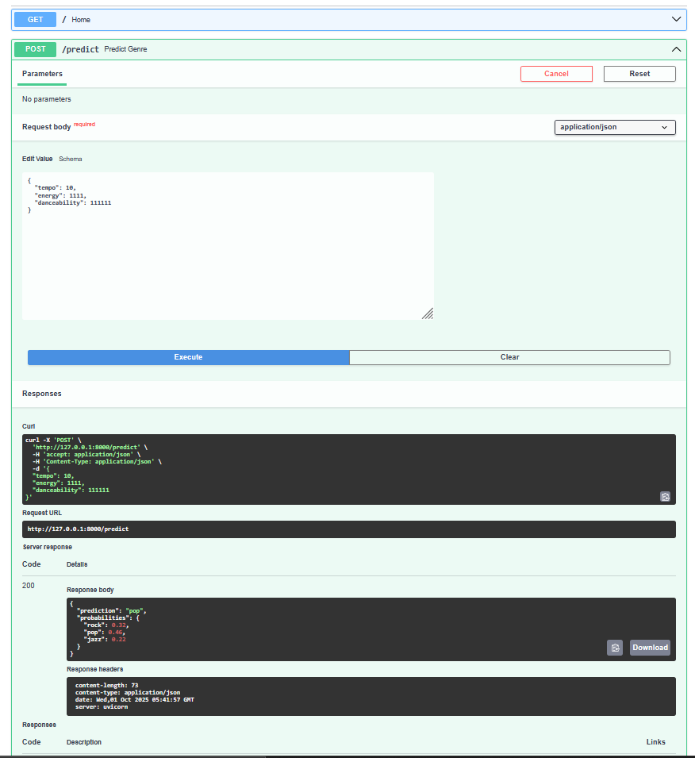

# Fast API 

I'm using a simple example - music album classification.
Going to use the following features to classify:
-    tempo (bpm)
-    energy (0-1)
-    danceability (0-1)


## Installations

```
python -m venv venv
source venv/bin/activate or ./venv/Scripts/activate

pip install -r requirements.txt
```

## Running
- Train the model
```
   python .\train_model.py
    music genre model trained and saved!
```
- Run the API

```
uvicorn fastAPI:app --reload
INFO:     Will watch for changes in these directories: ['C:\\Users\\sgune\\sgune-dev\\sgune-ai\\fastapi']
INFO:     Uvicorn running on http://127.0.0.1:8000 (Press CTRL+C to quit)
INFO:     Started reloader process [5020] using StatReload
Model: RandomForestClassifier(n_estimators=50, random_state=42), Genres: ['rock', 'pop', 'jazz']
INFO:     Started server process [22692]
INFO:     Waiting for application startup.
INFO:     Application startup complete.
```

## Testing
```
>curl http://127.0.0.1:8000
{"message":"Welcome to Music Genre Classifier. Use /predict to guess genre"}

FOR LINUX:
curl -X POST "http://127.0.0.1:8000/predict" -H "Content-Type: application/json" -d '{"tempo":178,"energy":0.85,"danceability":0.45}'

FOR WINDOWS:
curl -X POST "http://127.0.0.1:8000/predict" -H "Content-Type: application/json" -d "{\"tempo\":178,\"energy\":0.85,\"danceability\":0.45}"


{"prediction":"rock","probabilities":{"rock":0.92,"pop":0.06,"jazz":0.02}}

```

## FastAPI docs get generated auomatically
```
http://127.0.0.1:8000/docs
```
