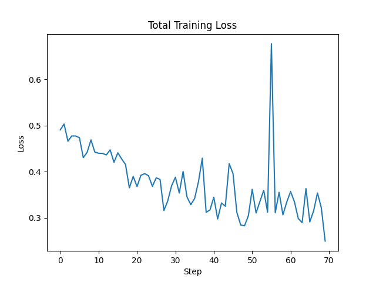
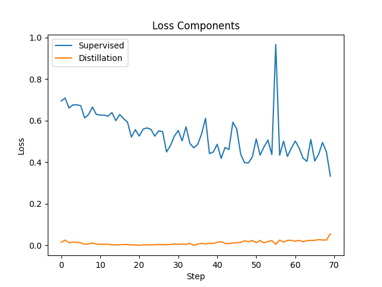
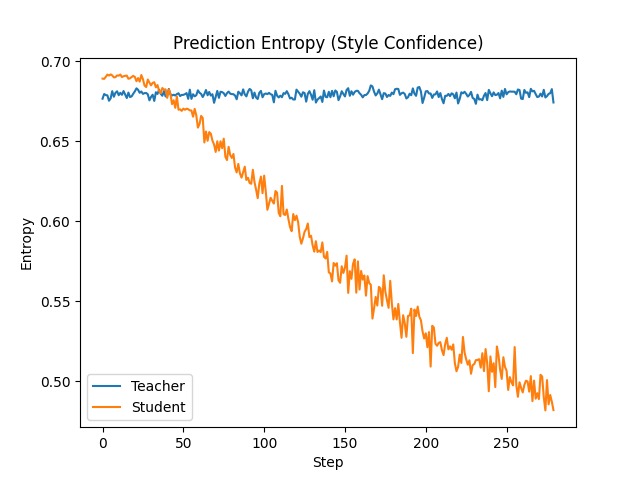

# Fine Tuning but it's Iron Maiden

### Fetching lyrics

- Windows
```
@("http://www.darklyrics.com/lyrics/ironmaiden/ironmaiden.html#1","http://www.darklyrics.com/lyrics/ironmaiden/womeninuniform.html#1","http://www.darklyrics.com/lyrics/ironmaiden/killers.html#1","http://www.darklyrics.com/lyrics/ironmaiden/thenumberofthebeast.html#1","http://www.darklyrics.com/lyrics/ironmaiden/pieceofmind.html#1","http://www.darklyrics.com/lyrics/ironmaiden/somewhereintime.html#1","http://www.darklyrics.com/lyrics/ironmaiden/wastedyears.html#1","http://www.darklyrics.com/lyrics/ironmaiden/caniplaywithmadness.html#1","http://www.darklyrics.com/lyrics/ironmaiden/noprayerforthedying.html#1","http://www.darklyrics.com/lyrics/ironmaiden/fearofthedark.html#1","http://www.darklyrics.com/lyrics/ironmaiden/bravenewworld.html#1","http://www.darklyrics.com/lyrics/ironmaiden/danceofdeath.html#1","http://www.darklyrics.com/lyrics/ironmaiden/amatteroflifeanddeath.html#1","http://www.darklyrics.com/lyrics/ironmaiden/thefinalfrontier.html#1","http://www.darklyrics.com/lyrics/ironmaiden/thebookofsouls.html#1","http://www.darklyrics.com/lyrics/ironmaiden/senjutsu.html#1") | % { $c=(Invoke-WebRequest $_ -UseBasicParsing).Content; $c -match '(?s)<div class="lyrics">.*?</div>' | Out-Null; ($matches[0] -replace '<br\s*/?>',"`n" -replace '<[^>]+>','' -replace '&nbsp;',' ' -replace '^\s+|\s+$','') | Out-File ((Split-Path $_ -Leaf).Split('.')[0]+".txt") -Encoding utf8 }

```

- Linux
```
for u in http://www.darklyrics.com/lyrics/ironmaiden/{ironmaiden,womeninuniform,killers,thenumberofthebeast,pieceofmind,somewhereintime,wastedyears,caniplaywithmadness,noprayerforthedying,fearofthedark,bravenewworld,danceofdeath,amatteroflifeanddeath,thefinalfrontier,thebookofsouls,senjutsu}.html; do curl -s "$u" | sed -n '/<div class="lyrics">/,/<\/div>/p' | sed -e 's/<br\s*\/\?>/\n/g' -e 's/<[^>]*>//g' -e 's/&nbsp;/ /g' | sed '1d;$d' > "$(basename "$u" .html).txt"; done

```


| ML Concept    | Iron Maiden Analogy                                                          |
| ------------- | ---------------------------------------------------------------------------- |
| Teacher model | **Steve Harris** (deep musical knowledge, complex bass lines)                |
| Student model | **New touring bassist** (lighter setup, needs to learn fast)                 |
| Dataset       | Lyrics / text classified as **“Iron Maiden–like” vs “Not Iron Maiden–like”** |
| Distillation  | Student learns not just *right/wrong*, but *why* Steve plays certain lines   |
| Entropy       | Confidence vs subtlety in musical choices                                    |


----

maiden_total_loss.png — “Is the student learning at all?”



Overall training objective

Combination of:

- “Be correct” (supervised loss)

- “Think like the teacher” (distillation loss)

This curve shows whether the student model is successfully optimizing its objective. A downward trend indicates that the model is simultaneously learning to classify lyrics correctly and align its judgment with the teacher model. Plateaus indicate convergence rather than failure when working with small datasets.


----
maiden_loss_components.png — “What kind of learning is dominating?”




- Blue: learning from labels

- Orange: learning from teacher behavior

This plot decomposes the total loss into supervised and distillation components. If supervised loss dominates, the model is relying more on labels. If distillation loss dominates, the student is primarily mimicking the teacher’s uncertainty structure. A healthy balance indicates regularization rather than memorization.

This graph is critical for explaining why distillation exists.
----
maiden_entropy.png — “Is the model becoming confident in a healthy way?”




- Teacher entropy: how uncertain the teacher is

- Student entropy: how uncertain the student is

Entropy measures prediction uncertainty. As training progresses, the student’s entropy should decrease gradually and approach the teacher’s entropy without collapsing to zero. This indicates that the student is learning to make confident predictions while still reflecting the teacher’s nuanced understanding. If the student’s entropy drops too quickly or too low, it may indicate overfitting or loss of valuable uncertainty information.
---
## Distillation
```
python .\distillation.py
Loaded 888 lyric samples
Map: 100%|████████████████████████████████████████████████| 888/888 [00:00<00:00, 7838.20 examples/s]
Some weights of BertForSequenceClassification were not initialized from the model checkpoint at bert-base-uncased and are newly initialized: ['classifier.bias', 'classifier.weight']
You should probably TRAIN this model on a down-stream task to be able to use it for predictions and inference.
Some weights of BertForSequenceClassification were not initialized from the model checkpoint at prajjwal1/bert-tiny and are newly initialized: ['classifier.bias', 'classifier.weight']
You should probably TRAIN this model on a down-stream task to be able to use it for predictions and inference.
Epoch 1/5: 100%|██████████████████| 56/56 [00:04<00:00, 12.20it/s, dist=0.080, loss=0.417, sup=0.501]

Epoch 1 summary:
  Avg total loss: 0.4995
  Avg supervised loss: 0.6148
  Avg distillation loss: 0.0384
  Avg student entropy: 0.6837
Epoch 2/5: 100%|██████████████████| 56/56 [00:04<00:00, 13.67it/s, dist=0.160, loss=0.340, sup=0.384]

Epoch 2 summary:
  Avg total loss: 0.3625
  Avg supervised loss: 0.4203
  Avg distillation loss: 0.1312
  Avg student entropy: 0.6357
Epoch 3/5: 100%|██████████████████| 56/56 [00:04<00:00, 13.62it/s, dist=0.272, loss=0.268, sup=0.267]

Epoch 3 summary:
  Avg total loss: 0.3045
  Avg supervised loss: 0.3242
  Avg distillation loss: 0.2258
  Avg student entropy: 0.5786
Epoch 4/5: 100%|██████████████████| 56/56 [00:04<00:00, 13.60it/s, dist=0.311, loss=0.363, sup=0.375]

Epoch 4 summary:
  Avg total loss: 0.2786
  Avg supervised loss: 0.2723
  Avg distillation loss: 0.3038
  Avg student entropy: 0.5339
Epoch 5/5: 100%|██████████████████| 56/56 [00:04<00:00, 13.59it/s, dist=0.426, loss=0.251, sup=0.207]

Epoch 5 summary:
  Avg total loss: 0.2659
  Avg supervised loss: 0.2420
  Avg distillation loss: 0.3614
  Avg student entropy: 0.5027
Training complete
Model saved to models/iron_maiden_distilled_student
Graphs saved to graphs/
```

## Inference
```
python .\maidenized.py .\random_lyrics_maiden.txt

🎵 Iron Maiden Style Scan
========================================
File: .\random_lyrics_maiden.txt
Chunks analyzed: 1
Average Maiden probability: 0.819
High-confidence Maiden chunks (>0.8): 1

Verdict:
 SCREAM FOR ME! Its IRON MAIIIDENNNN

Top scoring chunks:

[1] Score: 0.819
There's a time to live and a time to die When it's time to meet the maker There's a time to live but isn't it strange That as soon as you're born you're dying

```

- Trying out Taylor Swift's "Shake It Off":
```
python .\maidenized.py .\data\non_maiden\shake_it_off.txt

🎵 Iron Maiden Style Scan
========================================
File: .\data\non_maiden\shake_it_off.txt
Chunks analyzed: 14
Average Maiden probability: 0.770
High-confidence Maiden chunks (>0.8): 2

Verdict:
Eddie is sus. This might be Maiden, but can't tell

Top scoring chunks:

[1] Score: 0.809
brought his new girlfriend She's like, "Oh my God!" but I'm just gonna shake And to the fella over there with the hella good hair Won't you come on over, baby? We can shake, shake, shake (yeah) Yeah, ...

[2] Score: 0.803
I stay out too late Got nothing in my brain That's what people say, mm-mm That's what people say, mm-mm I go on too many dates But I can't make 'em stay At least that's what people say, mm-mm That's

[3] Score: 0.797
off, I shake it off (whoo-hoo-hoo) Hey, hey, hey Just think, while you've been gettin' down and out about the liars And the dirty, dirty cheats of the world You could've been gettin' down to this sick...

```