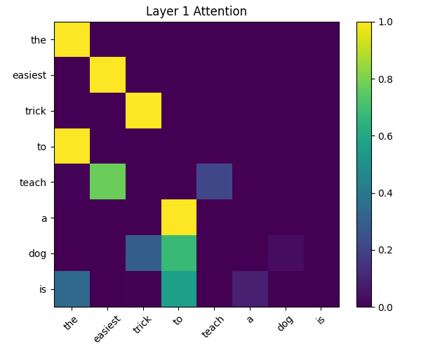
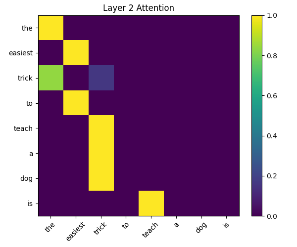
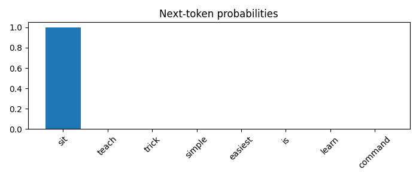

# A Mini LLM
Im building a mini LLM to understand how transformers work.

```
User Question
   ↓
Tokenization
   ↓
Embedding lookup
   ↓
Transformer Layer 1
   - Q, K, V
   - Attention scores
   - Attention output
   ↓
Transformer Layer 2
   ↓
...
   ↓
Final logits
   ↓
Softmax probabilities
   ↓
Next-token prediction
```

## Visualizations




## Sample run
```


Training output head...

Epoch   0 | Loss 518.082
Epoch  50 | Loss 465.814
Epoch 100 | Loss 387.881
Epoch 150 | Loss 331.572

Training complete.


Ask a prompt (or 'quit'): the easiest trick to teach a dog is

================ TOKENIZATION ================
['the', 'easiest', 'trick', 'to', 'teach', 'a', 'dog', 'is']

================ EMBEDDINGS ================
[[ 0.06   2.463 -0.192  0.302 -0.035 -1.169  1.143  0.752]
 [ 0.738  0.171 -0.116 -0.301 -1.479 -0.72  -0.461  1.057]
 [-0.783 -0.322  0.814 -1.231  0.227  1.307 -1.607  0.185]
 [ 0.791 -0.909  1.403 -1.402  0.587  2.19  -0.991 -0.566]
 [ 0.296  0.261  0.005 -0.235 -1.415 -0.421 -0.343 -0.802]
 [-0.469  0.543 -0.463 -0.466  0.242 -1.913 -1.725 -0.562]
 [-0.544  0.111 -1.151  0.376 -0.601 -0.292 -0.602  1.852]
 [-0.839 -0.309  0.331  0.976 -0.479 -0.186 -1.106 -1.196]]

================ LAYER 1 ================

Attention weights:
[[1.    0.    0.    0.    0.    0.    0.    0.   ]
 [0.    1.    0.    0.    0.    0.    0.    0.   ]
 [0.    0.    1.    0.    0.    0.    0.    0.   ]
 [0.999 0.    0.001 0.    0.    0.    0.    0.   ]
 [0.012 0.776 0.    0.    0.212 0.    0.    0.   ]
 [0.    0.    0.    1.    0.    0.    0.    0.   ]
 [0.    0.    0.295 0.672 0.    0.    0.033 0.   ]
 [0.341 0.    0.007 0.565 0.    0.086 0.    0.   ]]

Layer output:
[[ 2.67  -2.272  1.673 -8.861 -4.602  5.504  3.973 -5.92 ]
 [-5.378  3.77  -5.03   1.373 -3.14   4.64   6.992  6.722]
 [ 2.003  0.78  -0.937 -0.023 -0.952 -2.149 -3.01  -2.338]
 [ 2.669 -2.269  1.67  -8.851 -4.598  5.496  3.966 -5.916]
 [-4.655  3.006 -4.048  2.108 -1.459  3.932  6.88   6.049]
 [-1.75  -1.471 -3.235  1.512  0.925 -1.077 -1.279 -0.445]
 [-0.626 -0.624 -2.582  0.948  0.169 -1.346 -1.777 -0.907]
 [ 0.513 -1.382 -0.262 -2.577 -1.528  0.92  -0.254 -2.463]]

================ LAYER 2 ================

Attention weights:
[[1.    0.    0.    0.    0.    0.    0.    0.   ]
 [0.    1.    0.    0.    0.    0.    0.    0.   ]
 [0.839 0.    0.161 0.    0.    0.    0.    0.   ]
 [0.    1.    0.    0.    0.    0.    0.    0.   ]
 [0.    0.    1.    0.    0.    0.    0.    0.   ]
 [0.    0.    1.    0.    0.    0.    0.    0.   ]
 [0.    0.    1.    0.    0.    0.    0.    0.   ]
 [0.    0.    0.    0.    1.    0.    0.    0.   ]]

Layer output:
[[ -0.797  17.084  -0.156  61.481 -60.694  41.894  36.722  41.021]
 [-15.615  13.321  15.96  -12.473  51.34  -41.661  30.995  28.766]
 [  1.146  11.389  -0.558  52.725 -51.767  35.906  28.777  32.519]
 [-15.615  13.321  15.96  -12.473  51.34  -41.661  30.995  28.766]
 [ 11.259 -18.257  -2.649   7.148  -5.301   4.737 -12.576 -11.737]
 [ 11.259 -18.257  -2.649   7.148  -5.301   4.737 -12.576 -11.737]
 [ 11.259 -18.257  -2.649   7.148  -5.301   4.737 -12.576 -11.737]
 [-13.414  10.905   8.978 -16.98   43.585 -33.187  19.12   20.072]]

================ OUTPUT HEAD ================
       sit : 1.0000
     teach : 0.0000
     trick : 0.0000
    simple : 0.0000
   easiest : 0.0000
        is : 0.0000
     learn : 0.0000
   command : 0.0000
  training : 0.0000
   usually : 0.0000

Predicted next token: sit
```

