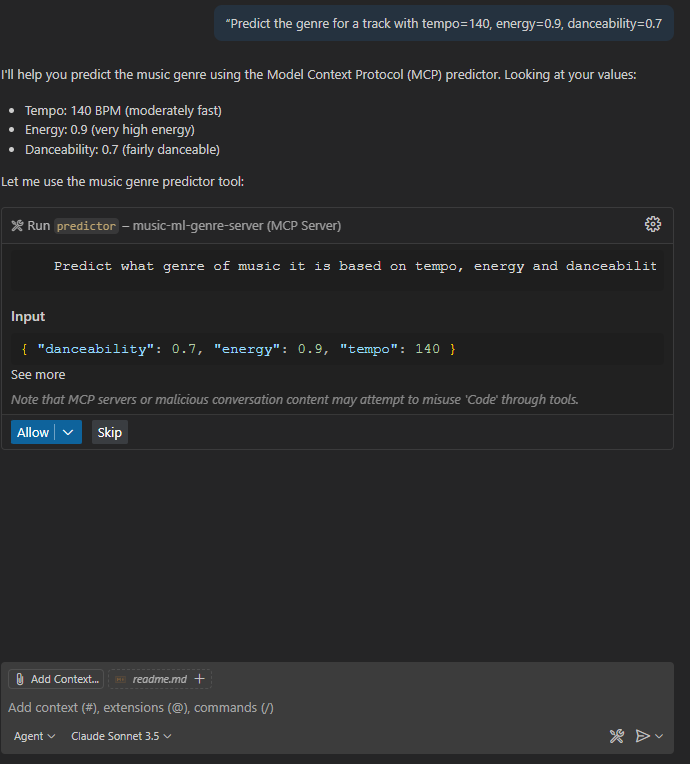

# MCP SERVER
Going to use the music genre prediction model to then create an MCP server and have it hooked up to copilot and Sonnet.




## TESTING
```
[info] Starting server music-ml-genre-server
[info] Connection state: Starting
[info] Starting server from LocalProcess extension host
[info] Connection state: Starting
[info] Connection state: Running
[warning] [server stderr] [10/01/25 22:34:33] INFO     Processing request of type           server.py:664
[warning] [server stderr]                              ListToolsRequest
[warning] [server stderr]                     INFO     Processing request of type           server.py:664
[warning] [server stderr]                              ListPromptsRequest
[info] Discovered 1 tools
[warning] [server stderr] [10/01/25 22:49:26] INFO     Processing request of type           server.py:664
[warning] [server stderr]                              CallToolRequest
```