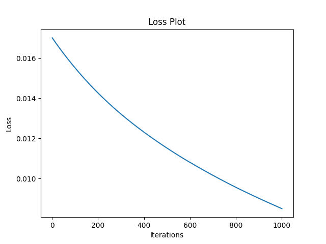
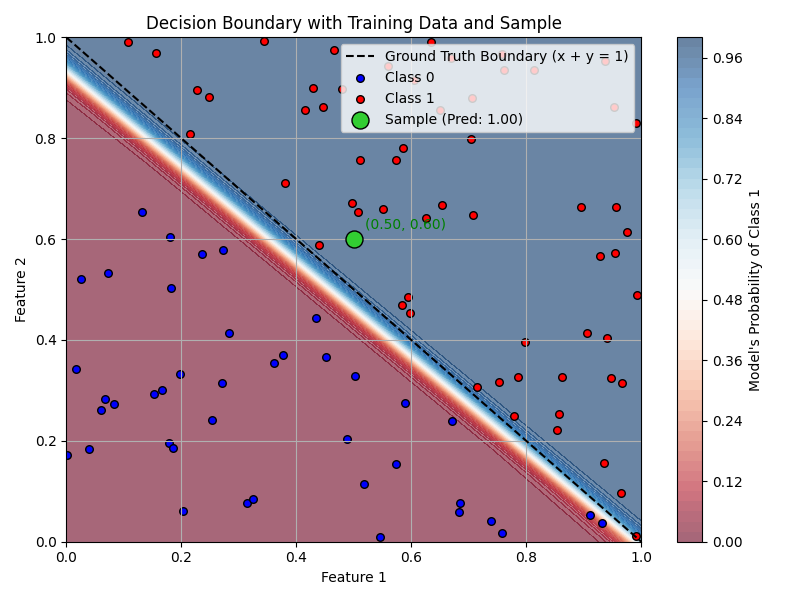

# Neural Network Binary Classifier

This project implements a simple neural network for binary classification using PyTorch. The network learns to classify points in a 2D space based on whether the sum of their coordinates is greater than 1.

## Overview

The neural network is designed to learn a decision boundary that separates points into two classes:

- Class 1 (Red): Points where x + y > 1
- Class 0 (Blue): Points where x + y ≤ 1

## Implementation Details

### Data Generation

- Creates 100 random samples in 2D space (each sample has 2 features)
- Features are randomly generated between 0 and 1
- Labels are assigned based on the sum of features:
  - Label 1: if x + y > 1
  - Label 0: if x + y ≤ 1


### Testing
```
x is torch.Size([100, 2])
y is torch.Size([100, 1])
Model object created: sguneNN(
  (fc1): Linear(in_features=2, out_features=4, bias=True)
  (relu): ReLU()
  (fc2): Linear(in_features=4, out_features=1, bias=True)
  (sigmoid): Sigmoid()
)


```

- Sample 1: tensor([[0.4000, 0.3000]]) (Expected class 0)
```
Model Weights and Biases:
fc1 weights:
 tensor([[-2.6212, -2.7453],
        [ 3.0169,  3.1058],
        [ 4.1477,  4.0912],
        [ 2.4836,  3.4476]])
fc1 biases:
 tensor([ 3.3463, -2.4251, -3.4228, -2.4085])
fc2 weights:
 tensor([[-3.6086,  3.3511,  3.4046,  3.2942]])
fc2 biases:
 tensor([-1.7466])

OG: tensor([[0.4000, 0.3000]]), Prediction: 0.0008524731965735555
which means, I'm 0.08524731965735555 % confident
Sample Sum of tensor([[0.4000, 0.3000]]) is : tensor([0.7000]) and based on that, it feels like its 0
Final Loss after 1000 runs is 0.0170
```


- Sample 2: tensor([[0.5000, 0.6000]]) (Expected class 1)
```
Model Weights and Biases:
fc1 weights:
 tensor([[-3.3142, -3.3936],
        [ 3.9781,  4.1895],
        [ 5.5531,  5.3730],
        [ 3.2896,  4.1986]])
fc1 biases:
 tensor([ 4.0301, -3.5039, -4.8171, -3.2100])
fc2 weights:
 tensor([[-4.3691,  4.6018,  4.5592,  4.1858]])
fc2 biases:
 tensor([-2.0048])
OG: tensor([[0.5000, 0.6000]]), Prediction: 0.9999727010726929
which means, I'm 99.99727010726929 % confident
Sample Sum of tensor([[0.5000, 0.6000]]) is : tensor([1.1000]) and based on that, it feels like its 1
Final Loss after 1000 runs is 0.0085
```




# Reference Notes Area

### Neural Network Architecture

The network (`sguneNN`) consists of:

1. Input Layer (`fc1`):
   - Input dimension: 2 (two features)
   - Output dimension: 4 (hidden layer neurons)
   - Maps 2D input space to 4D feature space

2. Hidden Layer Activation:
   - ReLU (Rectified Linear Unit)
   - Adds non-linearity for learning complex patterns
   - Helps prevent vanishing gradients

3. Output Layer (`fc2`):
   - Input dimension: 4 (from hidden layer)
   - Output dimension: 1 (probability output)
   - Sigmoid activation for binary classification

### Training Configuration

- **Loss Function**: Binary Cross-Entropy Loss (BCELoss)
  - Appropriate for binary classification
  - Measures how well predicted probabilities match actual labels

- **Optimizer**: Adam
  - Learning rate: 0.01
  - Adaptively modifies learning rate during training
  - Manages weights and biases updates

### Visualization

The code includes a comprehensive visualization function `plot_decision_boundary` that shows:

- 🔵 Blue regions: Model predicts class 0 (sum ≤ 1)
- 🔴 Red regions: Model predicts class 1 (sum > 1)
- ⚫ Dashed black line: True decision boundary (x + y = 1)
- Data points colored by their true class
- Color gradient showing prediction probabilities
- Optional sample point highlighting with predictions

## Usage

```python
# Create and train the model
model = sguneNN()
criterion = nn.BCELoss()
optimizer = optim.Adam(model.parameters(), lr=0.01)

# Test a sample point
sample = torch.tensor([[0.4, 0.3]])  # Should predict class 0
runIT(sample, 1000, X, y, optimizer, criterion, model)
```

## Features

- **Training Progress**: Shows loss values and final model parameters
- **Model Inspection**: Prints weights and biases of each layer
- **Confidence Scores**: Provides probability predictions for test samples
- **Visual Analysis**: Plots decision boundaries and data distribution

## Requirements

- PyTorch
- NumPy
- Matplotlib

## Project Structure

```plaintext
neural-net/
├── binary_classification.py  # Main implementation
└── readme.md                # Documentation
```

## Notes

1. The model shows good convergence for this simple decision boundary
2. The visualization helps understand how the model separates the classes
3. Training multiple times may give slightly different results due to random initialization
4. The model generalizes well for this linear boundary problem

## Detailed Concepts Explanation

### Neural Network Internals

#### Layer Operations

1. **Input Layer (fc1)**:
   - Takes your 2D point (x, y) and transforms it using weights and biases
   - Example: If input is (0.4, 0.3), it multiplies these values by weights and adds biases
   - Maps to 4D space to give the network more flexibility in finding patterns
   - Formula: output = input × weights + bias

2. **ReLU Activation**:
   - Applies ReLU function: f(x) = max(0, x)
   - If input is negative, outputs 0
   - If input is positive, passes it through unchanged
   - Makes the network capable of learning non-linear patterns

3. **Output Layer (fc2)**:
   - Takes the 4D transformed data and produces a single number
   - Sigmoid function squashes this number between 0 and 1
   - Result is the probability of belonging to class 1

#### Vanishing Gradients

- **What it means**: During training, the network learns by calculating how much each weight should change
- **The Problem**: In deep networks, these changes can become extremely small (vanish) for early layers
- **Why it Matters**: If gradients vanish, early layers stop learning effectively
- **ReLU's Role**: Helps prevent vanishing gradients by not squashing values in positive range
- **Visualization**:
  ```
  Sigmoid: ──────▄──
  ReLU:    ────╱────
  ```

#### Learning Rate (0.01)
- **What it means**: How big of a step to take when adjusting weights
- **Too High (> 0.01)**: Model might overshoot optimal values, like overshooting target
- **Too Low (< 0.01)**: Model learns very slowly, might get stuck
- **Just Right (0.01)**: Makes steady progress without overshooting
- **Example**: 
  - If error suggests "move weight up by 10"
  - With lr=0.01, actually move up by 0.1 (10 × 0.01)
  - Prevents too dramatic changes

### Training Process

#### Loss Function (BCELoss)
- **Purpose**: Measures how wrong the model's predictions are
- **How it Works**:
  1. Model predicts probability (0.7 means 70% sure it's class 1)
  2. Compares with true label (0 or 1)
  3. Higher loss = bigger mistake
- **Example**:
  - Prediction: 0.7, True label: 1 → Small loss
  - Prediction: 0.7, True label: 0 → Large loss

#### Optimizer (Adam)
- **Purpose**: Updates weights to reduce loss
- **Process**:
  1. Calculates gradients (directions of steepest error)
  2. Uses learning rate to decide step size
  3. Maintains separate learning rates for each weight
  4. Adjusts learning rates based on past updates

### Visualization Explained

#### Decision Boundary Plot
1. **Color Gradient**:
   - 🔵 Deep Blue: Model very confident it's class 0 (near 0% probability)
   - 🔵 Light Blue: Less confident it's class 0
   - 🔴 Light Red: Less confident it's class 1
   - 🔴 Deep Red: Model very confident it's class 1 (near 100% probability)

2. **Lines**:
   - ⚫ Dashed Line: True boundary where x + y = 1
   - Color Transition: Model's learned boundary
   - Perfect Model: Color transition matches dashed line

3. **What to Look For**:
   - Sharp color transition = confident predictions
   - Transition matching dashed line = accurate model
   - Scattered points correctly colored = good classification
   - Gradient smoothness = prediction confidence