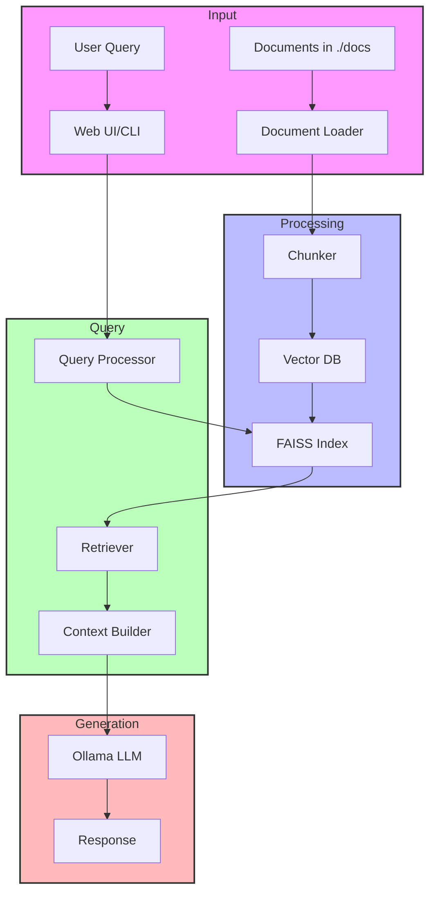
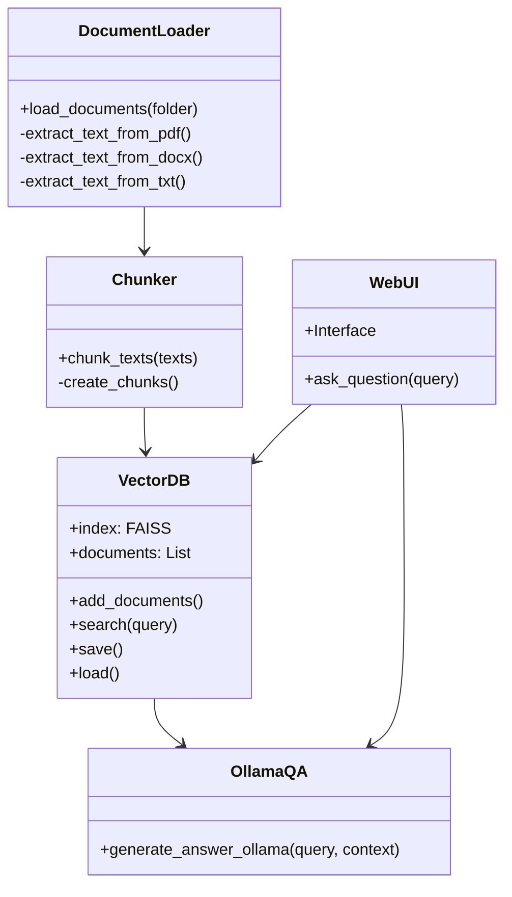

## System Architecture

### Data Flow Diagram

```mermaid
graph TB
    subgraph Input
        A[Documents in ./docs] --> B[Document Loader]
        Q[User Query] --> W[Web UI/CLI]
    end

    subgraph Processing
        B --> C[Chunker]
        C --> D[Vector DB]
        D --> E[FAISS Index]
    end

    subgraph Query
        W --> F[Query Processor]
        F --> E
        E --> G[Retriever]
        G --> H[Context Builder]
    end

    subgraph Generation
        H --> I[Ollama LLM]
        I --> J[Response]
    end

    style Input fill:#f9f,stroke:#333,stroke-width:2px
    style Processing fill:#bbf,stroke:#333,stroke-width:2px
    style Query fill:#bfb,stroke:#333,stroke-width:2px
    style Generation fill:#fbb,stroke:#333,stroke-width:2px
```

### Component Diagram

```mermaid
classDiagram
    class DocumentLoader {
        +load_documents(folder)
        -extract_text_from_pdf()
        -extract_text_from_docx()
        -extract_text_from_txt()
    }
    
    class Chunker {
        +chunk_texts(texts)
        -create_chunks()
    }
    
    class VectorDB {
        +index: FAISS
        +documents: List
        +add_documents()
        +search(query)
        +save()
        +load()
    }
    
    class OllamaQA {
        +generate_answer_ollama(query, context)
    }
    
    class WebUI {
        +Interface
        +ask_question(query)
    }

    DocumentLoader --> Chunker
    Chunker --> VectorDB
    VectorDB --> OllamaQA
    WebUI --> VectorDB
    WebUI --> OllamaQA
```
