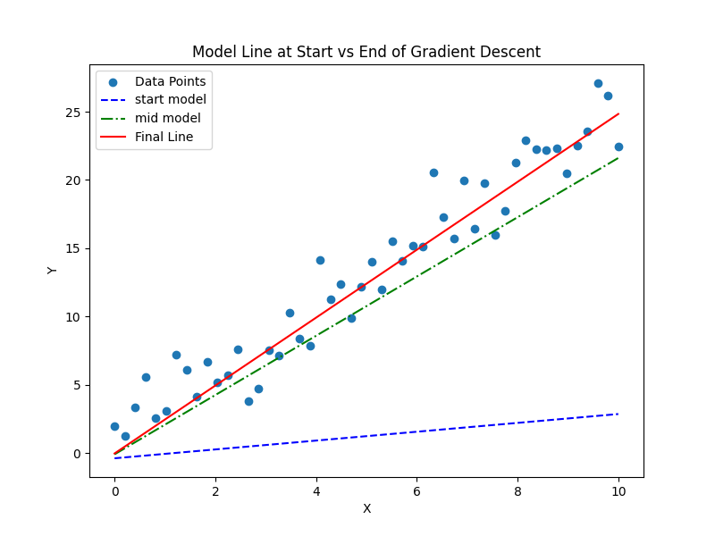

# Linear Regression using Gradient Descent
- Data points and model line (start, midpoint, and final fit).
- Loss curve over iterations (to show convergence).
- 3D loss surface with the gradient descent path.

We generates 50 points along a true line y = 2.5x + 1.0 with added Gaussian noise. 

## Testing
```
(venv) PS C:\Users\sgune\sgune-dev\sgune-ai\regression-gradient> python .\linear_regression.py
OG vector: [ 0.          0.20408163  0.40816327  0.6122449   0.81632653  1.02040816
  1.2244898   1.42857143  1.63265306  1.83673469  2.04081633  2.24489796
  2.44897959  2.65306122  2.85714286  3.06122449  3.26530612  3.46938776
  3.67346939  3.87755102  4.08163265  4.28571429  4.48979592  4.69387755
  4.89795918  5.10204082  5.30612245  5.51020408  5.71428571  5.91836735
  6.12244898  6.32653061  6.53061224  6.73469388  6.93877551  7.14285714
  7.34693878  7.55102041  7.75510204  7.95918367  8.16326531  8.36734694
  8.57142857  8.7755102   8.97959184  9.18367347  9.3877551   9.59183673
  9.79591837 10.]

Initial w,b and loss is =: [(0.324083969394795, -0.38508228041631654, np.float64(179.6693408962468))]
```

After running the iterations:

```
We hit convergence at iteration: 99
Length of history: 100
Converged after 100 iterations
Best fit line : y = 2.486x + -0.032
where w=2.486 and b=-0.032
```
- LOSS


- MODELS through Iterations


- Best Fit Line


- Loss Surface
